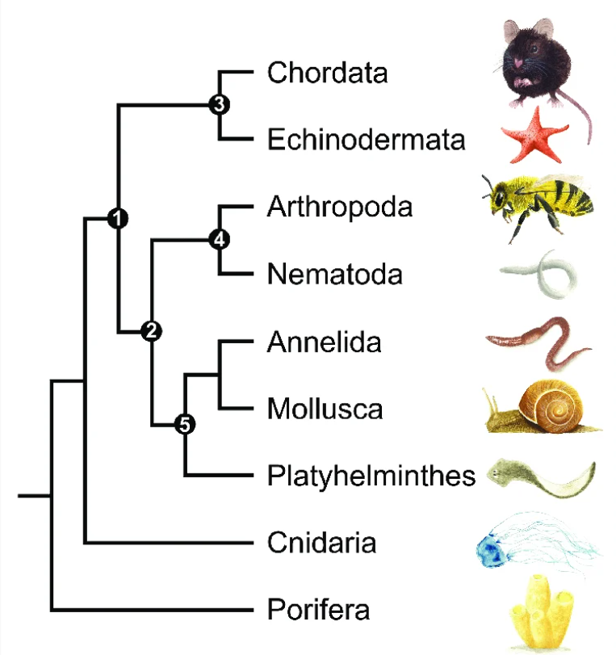
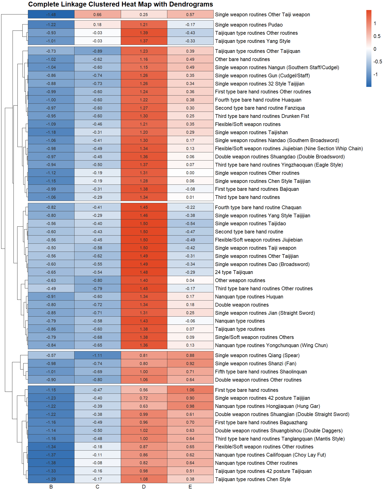
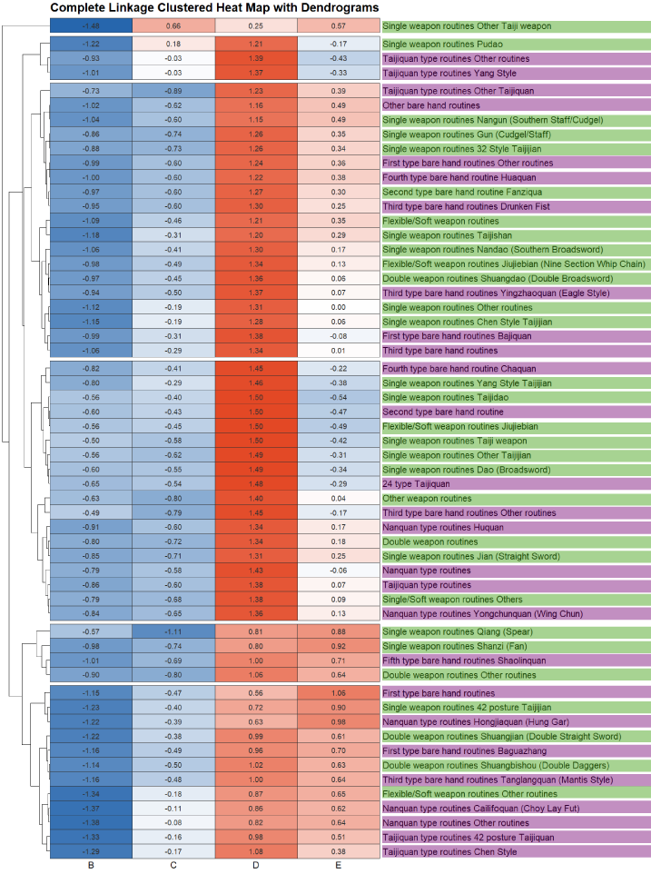

::: {.callout-note title="Notice" appearance="simple"}
Please note that these materials have not yet completed the required
pedagogical and industry peer-reviews to become a published module on
the SCORE Network. However, instructors are still welcome to use these
materials if they are so inclined.
:::

## Background

[Wang Shengrong, Group D, Winner Drunken Fist form, Team
China]{.column-margin}

<iframe width="560" height="315" src="https://www.youtube.com/embed/BFFqe0Iyqu0?si=feNJdiPCbuKkyCEB&amp;start=46" title="YouTube video player" frameborder="0" allow="accelerometer; autoplay; clipboard-write; encrypted-media; gyroscope; picture-in-picture; web-share" referrerpolicy="strict-origin-when-cross-origin" allowfullscreen>

</iframe>

### World Kung Fu Championships 2025: Forms, Groups, Ranking

The World Kung Fu Championships (WKFC), hosted by the International Wushu Federation (IWUF), is an international level sporting event established in 2004 to propagate the development of wushu around the world. As there are dozens of Kung Fu (traditional wushu) styles represented in the WKFC, these championships offer a unique platform for thousands of practitioners of all ages and varying skill levels to come together every two years.\
\
This module introduces Kung Fu to students in an exploratory approach allowing them to gain insight about the legendary sport, and explains the process of utilizing complex, raw sports data to analyze how championship scores relate across the competing Kung Fu forms.\
\
This module also introduces ingenious ways to address issues with missing data observations, and presenting that data in a meaningful graphic display that communicates the nature of the relationship across some variables at a glance.\

::: {.callout-note collapse="true" title="Learning Objectives" appearance="minimal"}
-   Learn about complete linkage hierarchical clustering including the following components.
    -   The role of z-scores in clustering.
    -   Intuitive understanding of Euclidean distance computations.
    -   Understanding dendrograms contextually and practically.
    -   Interpreting and constructing heat maps for data visualization.
    -   Using R code to compute their own complete linkage hierarchically clustered heat map.
:::

#### Competition Events

The championship welcomed athletes competing in the following two groups of Kung Fu forms:

Kung Fu events unaccompanied by weapons or any other objects:

<b>Individual Bare-hand Routines</b>

| Taijiquan-type Events | Nanquan-type Events | Other |
|-------------------|----------------------|-------------------------------|
| Chen Style | Yongchunquan (Wing Chun) | Xingyiquan |
| Yang Style | Wuzuquan (Ngo Cho) | Baguazhang |
| Wu Style | Cailifoquan (Choy Lay Fut) | Bajiquan |
| Wuu Style | Hongjiaquan (Hung Gar) | Tongbiquan |
| Sun Style | Dishuquan | Piguaquan |
| 42-posture Taijiquan | other southern styles | Fanziquan |
| other Taijiquan routines |  | Ditangquan |
|  |  | Yingzhaoquan (Eagle Style) |
|  |  | Tanglangquan (Mantis Style) |
|  |  | Chaquan |
|  |  | Huaquan |
|  |  | Paoquan |
|  |  | Hongquan |
|  |  | Shaolinquan |
|  |  | Wudangquan |
|  |  | Emeiquan |
|  |  | other types of traditional styles |

Kung Fu events including weaponry and other instruments:

<b>Weapon Events</b>

| Single-weapon Routines | Double-weapon Routines | Flexible/Soft-weapon Routines |
|-------------------|----------------------|-------------------------------|
| Dao (Broadsword) | Shuangdao (Double Broadsword) | Jiujiebian (Nine Section Whip Chain) |
| Jian (Straight Sword) | Shuangjian (Double Straight Sword/ Double Long Tassel Straight Sword) | Shuangjiegun (Nunchucks) |
| Gun (Cudgel/Staff) | Shuangbian (DoubleNineSection Whip Chain/ One Nine Section Whip Chain with Broadsword) | Sanjiegun (Three Section Staff) |
| Qiang (Spear) | Shuanggou (Double Tiger Hooks) | Liuxingchui (Meteor Hammer) |
| Pudao | Shuangbishou (DoubleDaggers) | Shengbiao (Rope Dart) |
| Guandao (Kwan Dao) | Shuangyue (Bagua Double Deer Horn Knives) | other traditional flexible/soft-weapon routines |
| Shanzi (Fan) | other traditional double-weapon routines |  |
| Bishou(Dagger) |  |  |
| Changsuijian (Long Tassel Straight Sword) |  |  |
| Taijijian |  |  |
| 42-posture Taijijian |  |  |
| Taijidao |  |  |
| Taijiqiang |  |  |
| Taijishan |  |  |
| Zuijian (Drunken Sword) |  |  |
| Nandao(Southern Broadsword) |  |  |
| Nangun (Southern Staff/Cudgel) |  |  |
| other traditional single-weapon routines |  |  |

#### Data

The data for this module comes from the Result Book of the 2025 10th World Kung Fu Championship, from The International Wushu Federation (IWUF).\
\
The Result Book is only available online as a 218-page pdf document containing the tables from each event, group and form separately. This pdf document was parsed into a *.csv* document containing the same information. To gain an in-depth insight into the process that resulted in the clean data set that was used for the work within this module, please refer to another SCORE module titled "[World Kung Fu Championship - Data Scraping, Cleaning and Visualizing](https://iramler.github.io/slu_score_preprints/early_drafts/martial_arts/kungfu_cleaning/)".\
\
For the purpose of this module, the data as been cleaned and trimmed to include only individual events but not group events. The processed data used for this module already in matrix form is available for download in the `Materials` section.

#### Variables

<b>Variable Descriptions</b>

| Variable | Description | Age interval | Birth year intervals |
|-----------------|-----------------------|-----------------|-----------------|
| Form | Kung Fu form the athlete competed in |  |  |
| A | Means by form for Group A athletes | 11 and below | 2014 and after |
| B | Means by form for Group B athletes | 12‐14 | 2011 - 2013 |
| C | Means by form for Group C athletes | 15‐17 | 2008 - 2010 |
| D | Means by form for Group D athletes | 18‐39 | 1986 - 2007 |
| E | Means by form for Group E athletes | 40‐59 | 1966 - 1985 |
| F | Means by form for Group F athletes | 60 and above | 1965 and before |

## Complete Linkage Hierarchical Clustering
Hierarchical Clustering via Complete Linkage is a Machine Learning technique that groups clusters of data from the furthermost point to the point of reference. In hierarchical clustering, the two nearest clusters are repeatedly merged until the desired number of clusters is reached[^1].

[^1]: Lynin Sokhonn, et al. “Hierarchical Clustering via Single and Complete Linkage Using Fully Homomorphic Encryption.” Sensors, vol. 24, no. 15, 25 July 2024, pp. 4826–4826,   https://doi.org/10.3390/s24154826.

Complete linkage is the metric through which we measure the clusters' proximity. The distance between the clusters (the inter-cluster distance) is defined by the linkage method which can be single, complete, or average.[^2]

[^2]: “Heatmap Plot.” Thermofisher.com, 2026, apps.thermofisher.com/apps/help/MAN0010505/GUID-C7F25EF3-8918-468E-86C7-863FF8752875.html.

When making the heat map, the clusters' hierarchy is calculated by representing each score by a node in the plot that is successively joined to nodes nearest to it by branches until all points are combined into a single cluster.[^2]

A useful application of this method for our case study data set on Kung Fu is understanding how the forms and the age groups can be grouped in clusters to understand the relationships between these two variables with respect to the scores.

### Z-Scores

The z-score tells how many standard deviations the value is from the mean, and is independent of the unit of measurement.[^3]

[^3]: Lock, Robin H, et al. Statistics : Unlocking the Power of Data. Hoboken, Wiley, 2020.

$$Z = \frac{x-\mu}{\sigma}$$

We've calculated the means for each Form by groups B through E and turned those means into the columns of the data to be mapped by Kung Fu Form which are the rows of our data frame. This structure should be thought of as a matrix, with vectors for each age group.

Within the `pheatmap` function, the `scale` argument scales the means into Z-scores for those means. In our example, the means of scores have been centered and scaled by rows, this is, by Kung fu form. This computation gives us a normalized scaled measure of how far away from the mean each mean and we've chose to keep the data scaled by rows instead of the default _row *and* column_ because we are interested in understanding how scored change by form within age group columns.\
\
For any particular Kung Fu form, the z-score scaling computation would happen as:

$$\frac{\text{Mean score for a given age group - Mean score for the form across all age groups}}{\text{Standard deviation}}$$

Let's take a macro glance into how this computation happens specifically for the Eagle Style mean scores in groups B, C, D and E:

For each, let's grab the z-score and then compile everything as a little table

|  Group  |Eagle Style Score Means|Z-score|
|---------|---------------------|-----------|
| B       |       8.398      |   -0.942 |
| C       |       8.466      |   -0.5   |
| D       |       8.754      |   1.370  |
| E       |       8.554      |   0.071  |

Mean of Eagle Style Score Means: 8.543\
Standard deviation: 0.154
\
Eagle Style for Group B Z-score sample calculation:

$$\frac{8.398 - 8.543}{0.154} = -0.942$$
    
To produce the heat map in this module, the R code, used the option `scale= "row"`. In practice, these computations are not done manually.

Afterwards, we want to understand how far apart those z-scores are from *each other* to understand which forms are closer or further. Closer z-scores will form clusters. Let's move on to find out the behind-the-code computation of the distances between these z-scores.

### Euclidean distance

When making the heat map, the clusters' hierarchy is calculated by representing each score by a node in the plot that is successively joined to nodes nearest to it by branches until all points are combined into a single cluster.[^4]

[^4]: “Heatmap Plot.” Thermofisher.com, 2026,     apps.thermofisher.com/apps/help/MAN0010505/GUID-C7F25EF3-8918-468E-86C7-863FF8752875.html.

$$d = \sqrt{\Sigma(x_i - y_i)^2}$$

The rows of the data matrix are re-ordered according to the hierarchical clustering result, putting similar observations close to each other.\

For any two forms (rows), the computation of their Euclidean distance would be:

$$d = \sqrt{(\text{Form 2 Group B's z-score - Form 1 Group B' z-score})^{2} + (\text{Form 2 Group C's z-score - Form 1 Group C's z-score})^{2} ...} $$

Let's take a closer look into how R computes these distances behind the code to construct a heat map in a few seconds. Taking 42 posture Taijiquan and Chen Style Taijiquan as our exaple forms, let's see how the cluster get formed from the distances between forms we obtain:

Let Form 1 =  42 posture Taijiquan, and Form 2 = Chen Style Taijiquan\

$$d = \sqrt{\left(-1.27+1.33\right)^{2}+\left(-0.17+0.16\right)^{2}+\left(1.08-0.98\right)^{2}+\left(0.38-0.51\right)^{2}} = 0.175$$
They have a very small distance between each other, which explains why they get grouped together. In the same manner as with the z-scores, this computation is not done _by hand_, the code for the heat map instantly applies a sorting algorithm that computes two random distances first, then takes another form and compares their distance, this process goes on continuously until all the forms have been sorted into the smallest to greatest distances.\
\
Let's now see the result of all these computations combined!

### Heat Maps

A heat map is a graphical method for visualizing high-dimensional data, in which a table of numbers are encoded as a grid of colored cells. The rows and columns of the matrix are ordered to highlight patterns and are often accompanied by dendrograms. Heat maps are used in many fields for visualizing observations, correlations, missing values patterns, and more.[^5]

[^5]: “Introduction to Heatmaply.” Github.io, 2023, talgalili.github.io/heatmaply/articles/heatmaply.html.

The heat map in this module is a graphic representation of the unsupervised hierarchical clustering of Kung Fu forms across all age groups in the competition. In the plot, the forms and groups are arranged according to the similarity of the scores.

### Dendrograms

A dendrogram (or tree diagram) is a network structure. It is constituted of a root node that multifurcates off into to several nodes connected by branches. The last nodes of the hierarchy are called leaves.[^6]

[^6]: Holtz, Yan. “Dendrogram \| the R Graph Gallery.” R-Graph-Gallery.com, r-graph-gallery.com/dendrogram.html.

Dendrograms are commonly utilized in the field of Biology to represent groups of genetically resembling species.

{fig-alt="Dendrogram: Phylogentic tree example"
width="300" fig-align="center"}

::: column-margin
A simplified phylogenetic tree of the kingdom Animalia showing only the nine most species-rich phyla. This image has been slightly edited to enhance how clusters are formed.\

Reference: Omond, Shauni, et al. “Inactivity Is Nycthemeral, Endogenously Generated, Homeostatically Regulated, and Melatonin Modulated in a Free-Living Platyhelminth Flatworm.” Sleep, vol. 40, no. 10, Aug. 2017, https://doi.org/10.1093/sleep/zsx124.
:::

The diagram depicts clusters of phyla which represent clades that are formed from the evolutionary relationships descending from a common ancestor.\
\
Porifera split off first, Cnidaria split off next, after Porifera but before the bilaterian animals which are the rest of the groups shown. The remaining phyla (Arthropoda, Mollusca, etc.) form a more recently diverged cluster.\
\
The first cluster represents the deuterostome clade. The second cluster (Arthropoda and Nematoda) corresponds to ecdysozoans. The third cluster (Annelida, Mollusca, and Platyhelminthes) corresponds to spiralians (protostomes).\

The same conceptual understanding for dendrograms in this Biology example can be extrapolated to dendrograms annexed to heat maps. Below, we will expand on the analysis of a heat map combined with the information that dendrograms provide about clustering.

## Complete Linkage Hierarchically Clustered Heat Map

We have constructed a heat map with dendrograms to clearly identify the ways forms relate according to their average scores. Those means of scores have been standardized by z-scores. Z-scores $\sigma$-standard deviations from the mean in the positive direction have the bright red color and values $\sigma$-standard deviations from the mean in the negative direction are mapped in blue. On an intuitive level, we gain insight into how unusual a form's mean score is for each age group relative to the mean score for the entire age group across all forms.\

By manually deciding to establish 6 major clusters, we can think of this process as "cutting" vertically the outermost branches of the tree 6 times.

{.lightbox} [To gain the most information possible from the data, we removed groups A and F since their scores across forms were considerably (and understandably) lower than the other groups.]{.column-margin} 

**Cluster-by-cluster interpretation of the heat map**

::: column-margin
The number of clusters was deliberately set to 6. We could have opted for a different number of k-means clusters to be formed under the same mathematical principles.\
\
Choosing the number of clusters is often a hard decision. There are data-driven methods that can be used (none of which are perfect) to choose the most *optimal* number fo clusters. You can also use visual methods such as looking at clear breaks in the dendrogams. Occasionally, you might have subject-matter knowledge that gives you a good guess of how many clusters we should set the heat map to have.\
\
It is useful to find a balance between a small number of clusters that can be interpreted but not too small such that observations that are dissimilar from each other end up in the same cluster.
:::

|6.  This cluster is dominated by non-weapon events, abundantly Taijiquan events. These forms require balance, technical ability and enhanced experience, they're not over reliant on power explosivity and athleticism. It would be fair to interpret the general clustering trend of these forms thanks to their similarly mature nature, expressiveness, and traditional technique. Groups E and F carry the advantage.\
\
|5. This cluster is dominated by 75% weapon routines. On a similar way as the 6th cluster.\
\
|4. This cluster's scoring trend is very meaningful _stylistically_. The general patterns are positive z-scores in E and sometimes F, lower or moderate in group D, and negative in B.\
\
In general these forms require expression over athleticism. They emphasize intent, flow, and internal mechanics. Older groups (E and F) perform them better. They are able to thrive thanks to these forms being less dependent on jumps and speed bursts, resourcing their advantage on structure, rhythm, maturity and of course depth of understanding stylistic authenticity, which increases with age.
\
|3.  This cluster likely reflects noise and stylistic diversity. We are not able to conclude that there's a clean technical grouping. Z-scores are less extreme in this cluster and reflect more variability. It is very likely that the abundance in "other"-forms creates confounding groupings.
\
\
2.  This cluster makes _technical_ sense. These forms require mainly timing precision and expressive rhythm. Group B's performance likely lacks the refinement to gain the judges' highest rewards although they often represent optimal balance of athleticism and control.\
\
These forms expose athletes' instability, lack of intent, poor transitions, etcetera. This reflects quite starkly in harsher scoring for younger groups.\
\
|1. This cluster is populated only by Taiji weapon events. The technical clarity and precision required to score high in handling weapons within Taiji makes the scoring rightfully lean more positively for older athletes.\
\

Where clustering makes strong sense: \
-   High-skill and control-heavy forms\
-   Athletic competition forms grouped together\
-   Traditional/internal forms grouped together\

Where clustering is weaker:\
-   Mixed “Other” categories \
-   Some weapon/bare-hand mixing\
-   Forms with high stylistic variability\

::: {.callout-tip title="The `pheatmap` library"}
The `pheatmap` function from this library has been chosen for this task
because of the advantages it provides when drawing clustered heat maps
while having better control over some graphical parameters relative to
other functions that construct essentially the same type of graphic
display of data. Other useful options of functions to use when
constructing a heat map using R code include:\
- `geom_tile()`\
- `ggheatmap()`\
- `heatmaply()`\
- `heatmap.2()`\
- `complexheatmap()`\
- `levelplot()`\
- `d3heatmap()`
:::

Along with the `pheatmap` function, we have resourced the `RColorBrewer`
library to have better control over the color palette in our heat map This ability to control visual features in our data visualization endeavors represents a huge portion of our task in being effective communicating to the viewer our findings on the data-exploration process. It is important to utilize resources effectively and explore options from packages and libraries beyond those in the base.\

### Conclusions from the analysis

Athletes at the very beginning and end of their Kung Fu career can experience high levels of exhaustion, insufficient technique on the side of the infants participating and decay of explosiveness and endurance that a sport such as Kung Fu requires.\
\
Participants from the ages between 12 and 59 years old can be considered the most competitive athletes because they can leverage both the explosiveness and the endurance of being at the peak of age ability and the technique from having trained for long enough.\

Group D participants, thanks to being in their physical prime and having sufficient technique development excel in scoring across all Kung Fu forms.

Most of the *Single Weapon Routines* cluster together in scoring in two main clusters.

## Activity

For this module, the activity will be an involved exercise in creating a heat map similar to the one presented in this module, but using a different data set, this time from the *8th edition of the World Kung Fu Championships (2017)*.

**Tasks**\
1. From the `Materials` section, download the [data for the 8th edition of the WKFC (2017)](year8kungfudata.csv) data.\ 
2. Using the `pheatmap` Construct a complete linkage clustered heat map with dendrograms.\ 
3. Write an in-depth, cluster-by-cluster interpretation of your exploratory data visualization exercise.\ 

### Materials

For this module, the reference materials for the module are the [Kung Fu](mat_10kf.csv) data set, and [the code for this module's heat map](kungfu_module.qmd).\ 
\
For the solution file to the activity proposed above, the data to be used is [data from the 8th edition of the WKFC (2017)](year8kungfudata.csv), and the solved exercise is outlined in
[this solution Quarto document](kungfu_solution.qmd).

### Supplementary Data Information

Due to the nature of the competition and the manner in which the results were presented, some adjustments in variable use and form identification had to be made to use the data meaningfully for this module.\

Below is some information from the result book that did not form a part of the final data.

<b>Omitted Variables</b>

-   **Bib number**
Personal identifying four-digit number representing each athlete in the competition.

-   **Team**
Unique, three-letter identifier for the country each athlete represented
in the competition.

-   **Athlete**
Athlete's full legal name.

-   **Athletes' sex**
"Men" or "Women" text specifying the sex of the athlete in the competition.

-   **Awards**
1st, 2nd or 3rd Category Prize. Gold, Silver or Bronze.

-   **FOP \#**
Field of play. Which competition area the event took place in (FOP 1, FOP 2, etc.)

-   **Group \#**
Which group number of athletes competed when multiple age groups competed in the same Kung Fu form or both sexes.

**Supplementary Image 1.** \

<b>Complete Linkage Clustered Heat Map with Highlighted Forms of the same Event type.</b>

{width=50% fig-align="center"}

::: column-margin
This image aids the interpretation of the heat map focusing on which types of events are clustering together more often across each major cluster.\
Forms highlighted in green belong to *Individual Events* and events highlighted in purple, *Weapon Events*.
:::

