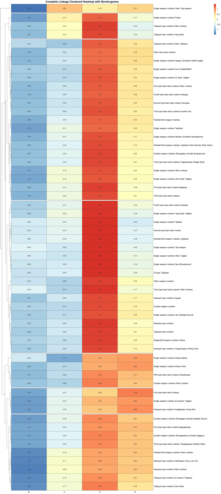

```{r}
#| message: false
#| echo: false
#| warning: false

# Loading the libraries in:

library(pdftools)
library(tidyverse)
library(ggplot2)
library(here)
```

## Background






### World Kungfu Championships 2025: Forms, Groups, Ranking

The World Kung fu Championships (WKFC), hosted by the IWUF, is an international level sporting event established in 2004 to propagate the development of wushu around the world. As there are dozens of kung fu (traditional wushu) styles represented in the WKFC, these championships offer a unique platform for thousands of practitioners of all ages and varying skill levels to come together every two years.\

##### Competing Kung Fu Events
The table below depicts all the participating kung fu forms at the 10th WKFC.

### Individual Events

| Taijiquan-type Events | Nanquan-type Events | Other |
|-------------------|----------------------|-------------------------------|
| Chen Style | Yongchunquan (Wing Chun) | Xingyiquan |
| Yang Style | Wuzuquan (Ngo Cho) | Baguazhang |
| Wu Style | Cailifoquan (Choy Lay Fut) | Bajiquan |
| Wuu Style | Hongjiaquan (Hung Gar) | Tongbiquan |
| Sun Style | Dishuquan | Piguaquan |
| 42-posture Taijiquan | other southern styles | Fanziquan |
| other Taijiquan routines |  | Ditangquan |
|  |  | Yingzhaoquan (Eagle Style) |
|  |  | Tanglangquan (Mantis Style) |
|  |  | Chaquan |
|  |  | Huaquan |
|  |  | Paoquan |
|  |  | Hongquan |
|  |  | Shaolinquan |
|  |  | Wudangquan |
|  |  | Emeiquan |
|  |  | other types of traditional styles |

### Weaponry

| Single-weapon Routines | Double-weapon Routines | Flexible/Soft-weapon Routines |
|-------------------|----------------------|-------------------------------|
| Dao (Broadsword) | Shuangdao (Double Broadsword) | Jiujiebian (Nine Section Whip Chain) |
| Jian (Straight Sword) | Shuangjian (Double Straight Sword/ Double Long Tassel Straight Sword) | Shuangjiegun (Nunchucks) |
| Gun (Cudgel/Staff) | Shuangbian (DoubleNineSection Whip Chain/ One Nine Section Whip Chain with Broadsword) | Sanjiegun (Three Section Staff) |
| Qiang (Spear) | Shuanggou (Double Tiger Hooks) | Liuxingchui (Meteor Hammer) |
| Pudao | Shuangbishou (DoubleDaggers) | Shengbiao (Rope Dart) |
| Guandao (Kwan Dao) | Shuangyue (Bagua Double Deer Horn Knives) | other traditional flexible/soft-weapon routines |
| Shanzi (Fan) | other traditional double-weapon routines |  |
| Bishou(Dagger) |  |  |
| Changsuijian (Long Tassel Straight Sword) |  |  |
| Taijijian |  |  |
| 42-posture Taijijian |  |  |
| Taijidao |  |  |
| Taijiqiang |  |  |
| Taijishan |  |  |
| Zuijian (Drunken Sword) |  |  |
| Nandao(Southern Broadsword) |  |  |
| Nangun (Southern Staff/Cudgel) |  |  |
| other traditional single-weapon routines |  |  |

#### Groups

The competition welcomes competitors of all ages. The age categories are divided according to the following periods.\
\

| Groups | Age | Classification on age requirements for competition |
|:--------:|:---------------------:|:-------------------------------------:|
| A | 11 years of age and below | Born in and after 2014 |
| B | 12‐14 years of age | The year of birth: 2011 - 2013 |
| C | 15‐17 years of age | The year of birth: 2008 - 2010 |
| D | 18‐39 years of age | The year of birth: 1986 - 2007 |
| E | 40‐59 years of age | The year of birth: 1966 - 1985 |
| F | 60 years of age and above | Born in and before 1965 |

#### Awards

-   1st, 2nd and 3rd Category Prize recipients will receive medals and achievement certificates.\
-   If the actual number of participants is 12 or more persons in an individual event, the awarding methods are as follows:\
    Gold, silver and bronze medals and certificates will be awarded to the athletes ranked top 3 of the individual events respectively.\
-   2nd Category Prize (Awarded to 20% of the actual number of participants) recipients will receive medals and achievement certificates.\
-   3rd Category Prize (Awarded to 30% of the actual number of participants) recipients will receive medals and achievement certificates.\
-   Other athletes will receive participation certificates only.

#### Data

The data comes from the results book of the 2025 10th World Kung Fu Championship, from The International Wushu Federation (IWUF).\
\
The result book is only available online as a 218-page pdf document containing the tables from each event, group and form separately. This pdf document was parsed into a csv document containing the same information.\
\
For the purpose of this module, the data as been trimmed to include only individual events but not group events.\
\
The ready-to-use data set in matrix form is available for this module in the `Materials` section.


##### Variables

<details>

<summary><b>Variable Descriptions</b></summary>

| Variable | Description                                |
|----------|--------------------------------------------|
| Form  | Kung fu form the athlete competed in |
| A | Means per form for Group A participants |
| B | Means per form for Group B participants |
| C | Means per form for Group C participants |
| D | Means per form for Group D participants |
| E | Means per form for Group E participants |
| F | Means per form for Group F participants |

</details>

Data by years:

7th:\

[Reference document](https://www.iwuf.org/wp-content/uploads/2018/12/7th-World-Kungfu-Championships-Regulations.pdf)

This year's data only comprehends 5 age groups-\> unusable for our purposes.

8th:\
[Reference document](https://www.iwuf.org/wp-content/uploads/2018/12/7th-World-Kungfu-Championships-Regulations.pdf)

9th:\
[Reference document](https://www.iwuf.org/wp-content/uploads/2018/12/7th-World-Kungfu-Championships-Regulations.pdf)

##### Materials

For this module, the materials are the [kung fu](mat_10kf.csv) data set and [the solution QMD](kungfu.qmd).

### Complete Linkage Hierarchical Clustering

Hierarchical Clustering via Complete Linkage is a Machine Learning technique that groups clusters of data from the furthermost point to the point of reference. In hierarchical clustering, the two nearest clusters are repeatedly merged until the desired number of clusters is reached. (Sokhonn, Park, Lee , 2024 , "Hierarchical Clustering via Single and Complete Linkage Using Fully Homomorphic Encryption") Complete linkage is the metric through which we measure the clusters' proximity.

This process serves as an exploratory data analysis technique, categorizing data into distinct groups or subsets, where elements within each subset are more similar to each other than to elements in different subsets. A useful application of this method for our case study data set on Kung Fu is understanding how the forms and the age groups can be grouped in clusters to understand the relationships between these two variables with respect to the scores.

Our goal for this modules becomes mainly to answer some questions such as:


#### The Heatmap here:
{.lightbox}


