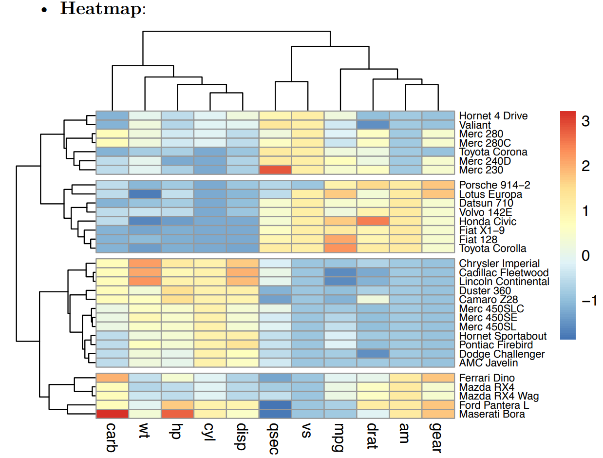

### Load libraries

```{r}
#| message: false
#| warning: false

# Loading the libraries in:
library(tidyverse)
library(ggplot2)
library(stargazer)
library(pheatmap)
```

### Know Thy Data

```{r}
kungfu<- read.csv("kungfu_data_dirty.csv")
head(kungfu, 25)
```

Because of the way the raw data was presented in the result book, the parsing process helped us, but only so much! We have a lot of information in the result book data about the athletes and the organization of the competition that we can use for the data analysis process, but it is not in a useful format in the current way it's presented after the parsing process.

We'll need to do some significant `stringr` work to separate the information in column labeled `Form` into:\
1. Athlete sex\
2. Kung fu form\
3. Group

```{r}
#| message: false
#| warning: false


# this took forever to figure out 

kungfu_strings <- kungfu |> select(-Page) |> filter(Form != "Bare-hand Duilian(2 Persons)", Form != "Weapon Duilian(2 Persons)", Form != "Other Duilian") |> # this line gets rid of the form "duilian" because that's a group event
  separate_wider_regex(Form, c(sex = "^.", Form = ".*")) # this made the Sex column with the first letter of the words "Men's" and "Women's"
```

```{r}
#| message: false
#| warning: false

# this code gets rid of the end of "en's and "omen's"
getting_rid_of_up_to_form <- kungfu_strings |> separate_wider_regex(Form,
  patterns = c(
    delete = "^[^\\s]+",
    "\\s+",
    rest = ".*"))

# we're getting there 
```

```{r}
#| message: false
#| warning: false

# this code creates the form column by selecting everything up to the capital G for "Group" and by doing that creates the column for Group

selecting_the_form <- getting_rid_of_up_to_form |> select(-delete) |>  separate_wider_regex(rest,
  patterns = c(
    Form = ".*?(?=G)", 
    Group = ".*"))
```

Now the situation is manageable. The remaining step is carpentry that repairs the missing `Group` category we lost during the parsing process of the result book.\

Add the new final clean everything correct and checked thrice csv back into here: the data frame is called `kf`

```{r}
kf <- read.csv("kungfu.csv")
```

Now we can start working with the data set to decide what to delete and what to continue developing.

Things we can do:

1.  get rid of the entries for athletes who defaulted.

-   Defaulting in the competition means they either got disqualified or had to step away from the competition voluntarily. Both outcomes resulted in them not getting scored.

2.  get summary statistics for both gender groups.

3.  get summary statistics for each (of the 6) age groups.

4.  get summary statistics for each kung fu form in the competition.

5.  get summary statistics for each country participating.

### Part by part

```{r}
# the number of total athletes before removing defaulted athletes is 2129
sample_kungfu <- kf|> filter(Rank != "Default") |> drop_na(Score) |> select(-X, -Rank, -Remark) 
# the number of athletes after removing defaulting athletes is 1989
# difference is 140 athletes.


```

```{r}
kf_nodefault |> drop_na(Score) |> group_by(sex) |> summarise(mean(Score), print(mean(Score)))
meanteam <- kf_nodefault |> drop_na(Score) |> group_by(Team) |> summarise(mean(Score)) |> select(-Team)
getformscore<-kf_nodefault |> drop_na(Score) |> group_by(Form) |> summarise(mean(Score))
kf_nodefault |> drop_na(Score) |> group_by(Group) |> summarise(mean(Score))

# there are 1115 male competitors
# there are 874 female competitors

# wow kung fu is not that male dominated!

getformscore|> summarise(mean(`mean(Score)`))

ntnptpn <- kf_nodefault |> select(`Team`) |> mutate(countries = factor(Team)) |> group_by(countries) |> summarise(count = n()) |> arrange(desc(count))
# 45 countries
print(ntnptpn)

```

| Mean for Sexes | Mean for all Teams | Mean for all Forms | Mean by Group |
|----------------|--------------------|--------------------|---------------|
| Men 8.44       | 8.5                | 8.47               | Group A 7.43  |
| Women 8.43     |                    |                    | Group B 8.40  |
|                |                    |                    | Group C 8.45  |
|                |                    |                    | Group D 8.68  |
|                |                    |                    | Group E 8.55  |
|                |                    |                    | Group F 8.46  |

are there any forms where the difference across age groups is more amplified.

analyse by form, which group do they belong to?

### Cluster Analysis

#### Unsupervised/ supervised machine learning

{fig-align="center"}


```{r}
# This line shows the amount of events for each form
interesting <- sample_kungfu |> group_by(Form) |> summarise(haha = n())

# this line will explain why there are so many NA values in the matrix
```

###### Methods for measuring distances 
Need to choose a type of measuring distance that works well with very small differences and (in some cases) no distance!

For now, let's use Euclidean distance 
```{r}

# from the factoextra package , using the formula `fviz_hmfa` to generate the plot


# finding euclidean distance with R base function dist()
dist.eucl <- dist(df.scaled, method = "euclidean")

```


#### Hierarchical agglomerative clustering


[reference link for how to do the heatmap](https://www.datanovia.com/en/lessons/heatmap-in-r-static-and-interactive-visualization/)


```{r}
hehe_kungfu <- sample_kungfu |> group_by(Group, Form) |> summarise(mean_score = mean(Score), .groups = "drop")|> pivot_wider(names_from = Group, values_from = mean_score)
```


```{r}
mat <- as.matrix(hehe_kungfu[,-1])
rownames(mat) <- hehe_kungfu$Form
mat[is.na(mat)] <- 0
# now we have `na` values converted to zeroes
print(mat)

# now we will make the heatmap (accept a mess due to zeroes)
# or code zeroes to be black or neon, something that doesn't relate to 
# the rest of the heatmap's color spectrum

```

```{r}
#| label: heatmap
#| warning: false


pheatmap(
  mat,
  scale = "column", # BIG  QUESTION  MARK
  clustering_distance_rows = "euclidean",
  clustering_distance_cols = "euclidean",
  clustering_method = "complete",
  show_colnames = TRUE, 
  show_rownames = TRUE,
  fontsize_row = 7,
  fontsize_col = 7, 
  main = "Heatmap with dendrogram",
  legend = F)
```


```{r}
#| warning: false
#| eval: false
#| message: false
#| label: references

# reference code
heatmap(matrix_kf, scale = "column")
# custom color palette sample code
col<- colorRampPalette(c("red", "white", "blue"))(256)
library("RColorBrewer")
col <- colorRampPalette(brewer.pal(10, "RdYlBu"))(256)


heat_plot <- pheatmap(data, 
                      col = brewer.pal(10, 'RdYlGn'), # choose a colour scale for your data
                      cluster_rows = T, cluster_cols = T, # set to FALSE if you want to remove the dendograms
                      clustering_distance_cols = 'euclidean',
                      clustering_distance_rows = 'euclidean',
                      clustering_method = 'ward.D',
                      annotation_row = gene_functions_df, # row (gene) annotations
                      annotation_col = ann_df, # column (sample) annotations
                      annotation_colors = ann_colors, # colours for your annotations
                      annotation_names_row = F, 
                      annotation_names_col = F,
                      fontsize_row = 10,          # row label font size
                      fontsize_col = 7,          # column label font size 
                      angle_col = 45, # sample names at an angle
                      legend_breaks = c(-2, 0, 2), # legend customisation
                      legend_labels = c("Low", "Medium", "High"), # legend customisation
                      show_colnames = T, show_rownames = F, # displaying column and row names
                      main = "Super heatmap with annotations") # a title for our heatmap
```


These are the only events that have full participation for all age groups:\
- Single-weapon routines_Dao (Broadsword) \
- Single-weapon routines_Gun (Cudgel/Staff)\
- Single-weapon routines_Jian (Straight Sword) \
- bare-hand routines_Other routines\

