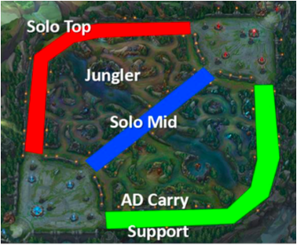

Please note that these material have not yet completed the required
pedagogical and industry peer-reviews to become a published module on
the SCORE Network. However, instructors are still welcome to use these
materials if they are so inclined.

### Welcome Video

For a humourous 3-minute introduction to League of Legends, please watch
this video by Kola, a League of Legends coach with
[Coachify](https://coachify.gg/@phoenixkola){target="_blank"}.

<iframe width="560" height="315" src="https://www.youtube.com/embed/saqFrVV-YsU?si=DGPaJg6JqSNcmw3g" title="YouTube video player" frameborder="0" allow="accelerometer; autoplay; clipboard-write; encrypted-media; gyroscope; picture-in-picture; web-share" referrerpolicy="strict-origin-when-cross-origin" allowfullscreen>

</iframe>

### Introduction

League of Legends (LoL) is a 5 v. 5 multiplayer online battle arena
(MOBA) game developed by Riot Games. In this game, players assume the
role of a "champion" with unique abilities and engage in intense battles
against a team of other players or computer-controlled champions.

In standard play on Summoner's Rift, champions are typically assigned to
roles that correspond to different lanes/positions on the map—most
commonly Top, Jungle, Mid, Bottom (AD Carry), and Support (see
@fig-srmap). Champions assigned to each position have distinct strategic
responsibilities (for example, the Jungler moves between lanes to secure
objectives, while the Support focuses on protecting and enabling
teammates). Champions also have narrative identities that include
attributes such as gender, and players often choose champions based on a
mix of gameplay fit (role/position) and character preference.

{#fig-srmap}

In this module, we will investigate whether the distribution of genders
differs across roles.

The majority of the champion metadata for this module comes from
[LoLdleData](https://github.com/Kerrders/LoLdleData){target="_blank"},
an open GitHub project that programmatically compiles "extra" champion
attributes that aren't conveniently available from the official Riot API
endpoints (e.g., gender, game lore region, and release year).

The LoLdleData is supplemented with laning information taken from the
fan-site [Mobalytics](https://mobalytics.gg/lol){target="_blank"} (based
on patch 16.2).

Because these are community-maintained, derived datasets, the gender and
lane labels should be treated as typical classifications rather than
official ground truth. In particular, lane/role assignments reflect a
snapshot based on patch 16.2, and many champions can be played
effectively in multiple lanes depending on strategy, player skill, and
balance changes.


::: {.callout-note collapse="true" title="Learning Objectives" appearance="minimal"}
By the end of this tutorial, students will be able to:

1.  Organize two categorical variables into a contingency table and
    compute row/column proportions.

2.  Create and interpret exploratory visualizations for two categorical
    variables (e.g., side-by-side bars, stacked proportion bars, mosaic
    plots).

3.  State hypotheses for the Chi-square test of association and explain
    what "independence" means in this context.

4.  Compute and interpret the Chi-square test statistic, degrees of
    freedom, and p-value using R.

5.  Check chi-square conditions by examining expected cell counts.

6.  Report and interpret an effect size for association.

7.  Use residuals / cell contributions to identify which category
    combinations drive the association.
:::

::: {.callout-note collapse="true" title="Activity Length" appearance="minimal"}
This could be suitable of an out of class activity or one that spans one or more class periods.


:::

::: {.callout-note collapse="true" title="Methods" appearance="minimal"}
**Technology Requirement:**

This activity is designed to be completed primarily in `R` using a
Quarto document workflow. Students should be comfortable importing data
and performing basic data wrangling with packages from the tidyverse
(especially `readr`, `dplyr`, and `tidyr`).

Statistical inference will be carried out using base R functions such as
`chisq.test()`.

We will also use the `vcd` package (Visualizing Categorical Data) to
create mosaic and association plots, including optional residual-based
shading that helps identify which category combinations contribute most
to the chi-square result.


:::

### Data

The `lol_gender_lanes_patch16.2.csv` dataset contains 172 rows, one per
League of Legends champion, and includes basic metadata used to study
the relationship between **champion gender** and **typical lane/role**
(based on patch 16.2). Several metadata fields are included for context
and potential extensions, but the primary variables for this module are
`gender` and `lane`.

Download Data:
[lol_gender_lanes_patch16.2.csv](lol_gender_lanes_patch16.2.csv)

<details>

<summary><b>Variable Descriptions</b></summary>

| Variable | Description |
|------------------------------------|------------------------------------|
| name | Champion name |
| title | Champion title/epithet (e.g., "the Sinister Blade") |
| resource | Champion's primary in-lore "resource" or energy system used for abilities (most are "Mana") |
| genre | Broad gameplay archetype label for the champion (Fighter, Assassin, etc.) |
| skinCount | Number of available skins for the champion at the time the dataset was compiled |
| gender | Champion gender label used for this analysis (male, female, NA) |
| attackType | Champion’s typical attack style (close vs. range) |
| releaseDate | Champion release date (year) |
| region | Champion’s primary lore region/faction (e.g., piltover, noxus, etc.) |
| lane | Champion’s typical lane/role assignment for Summoner’s Rift (adc, jungle, mid, support, top) |

</details>

#### Data Sources

-   [https://github.com/Kerrders/LoLdleData](https://github.com/Kerrders/LoLdleData){target="_blank"}

-   [https://mobalytics.gg/lol](https://mobalytics.gg/lol){target="_blank"}


:::{.callout-note collapse="true" title="Optional: Point-and-Click Software Version" appearance="minimal"}

A shortened version suitable as an example in an introductory statistics course that uses point-and-click software (e.g. Minitab or JMP) can be found here.

- Download Data:
[lol_gender_lanes_patch16.2-simplified.csv](lol_gender_lanes_patch16.2-simplified.csv)

_This version has the non-gendered champions removed and contains only the name of the champion, its gender, and primary lane._

- Handout: [Intro Stat Handout]() with [example Minitab output]()
- Handout: [Intro Stat Handout with Solutions]()

These handouts are designed to be used in an introductory statistics course that uses point-and-click style software. It can be edited to be used as an example along with an instructor's typical lecture style.
:::


## Analyzing Associations between Categorical Variables

### Motivating question

In this module, we investigate the following research question:

> **Is champion gender associated with typical lane/role in League of
> Legends?**

> In other words, **does the distribution of champion genders differ
> across the five Summoner's Rift roles** (Top, Jungle, Mid, Bottom/AD
> Carry, Support)?

### Prepping Workspace

To begin, we will need to load the packages we will be using. For this analysis, you'll need to load the `dplyr`, `tidyr`, `vcd`, `viridis`, and `vistributions` packages.

<details>
<summary><b>Click to reveal code</b></summary>

```{r}
#| echo: true
#| eval: false

# If you need to install any of these uncomment the line below
# install.packages(c("dplyr,"tidyr", "vcd", "ggplot2", "viridis", "vistributions"))

library(dplyr)
library(tidyr)
library(ggplot2)
library(vcd)
library(viridis)
library(vistributions)
```
</details>


Now we should read in the data. Save the csv file to your computer and read it in. For convenience, we will all store it as an object named `lol_genders`.


<details>
<summary><b>Click to reveal code</b></summary>

```{r}
#| echo: true
#| eval: false


# You might need to change the file path to match your setup.
lol_genders <- readr::read_csv("lol_gender_lanes_patch16.2.csv")
```
</details>

## Exploratory Analysis

Before attempting to conduct a formal statistical inference on these data, we will start with some numerical and graphical summaries to better understand the data.


### Univariate Analyses

We'll first investigate each of the main variables of interest (`gender` and `lane`) to familiarize ourselves with them.

- Start by make a table that displays the number of champions associated with each gender.

> Question: How many champions are included in this table? How many rows are there in the `lol_genders` dataset?

> Question: What might be happening?

Before continuing, lets remove these two champions that don't have an assigned gender. 

If you are curious which champions they are, run the following code.

```{r}
#| echo: true
#| eval: false


lol_genders |>
  filter(is.na(gender))
```


To remove them we can use the `drop_na` function from the `tidyr` package.

```{r}
#| echo: true
#| eval: false


lol_MFonly <- lol_genders |> drop_na(gender)
```

Now, we'll investigate the the `lane` variable. Be sure to use the trimmed dataset that excluded the champions that didn't have genders assigned to them.

```{r}
#| echo: true
#| eval: false


table(lol_MFonly$lane)
```


### Bivariate Analysis

Next, we move on to exploring the relationship between the `gender` and typical `lane` for the champions. There are a few ways we can do so.

#### Two-way tables

Also known as a *contingency table*, this is a grid of counts showing how many champions fall into each `gender × lane` combination.

The following code can make these tables for us.

```{r}
lol_2way_table <- table(lol_MFonly$gender,
                            lol_MFonly$lane)
```

We can also use the `addmargins` function to place the totals on the table too.
```{r}
lol_2way_table_with_margins <- addmargins(lol_2way_table)
lol_2way_table_with_margins
```

> Question: How many female champions are in the jungle role?

> Question: What percent of male champions are supports? What percent of support champions are male?


#### Bar charts

**Stacked (or grouped) bar charts** can be used to display the counts by lane with separate bars for gender.

We’ll start by using `ggplot2` to make a bar chart with `gender` on the x-axis and `lane` mapped to `fill`.

```{r}
ggplot(data = lol_MFonly, 
       mapping = aes(x = gender, fill = lane)
       ) +
  geom_bar()
```

In its current form, it is unnecessarily hard to compare lane distributions across genders, because the total number of champions differs by gender. To fix this, we can scale each bar to have a height of 1 (representing 100%). We do this by adding `position = "fill"` to `geom_bar()`.

```{r}
ggplot(data = lol_MFonly, 
       mapping = aes(x = gender, fill = lane)
       ) +
  geom_bar(position = "fill")
```


We can also clean up labels and themes to make the chart easier to interpret. In particular, changing the y-axis label to "Proportion" is helpful (since the bars now show proportions rather than raw counts). We can also use a color-blind friendly palette, such as `scale_fill_viridis_d()`.

```{r}
ggplot(data = lol_MFonly, 
       mapping = aes(x = gender, fill = lane)
       ) +
  geom_bar(position = "fill") +
  labs(y = "Proportion", 
       x = "Champion Gender", 
       fill = "Main Lane") +
  theme_bw() +
  scale_fill_viridis_d()
  
```

> Question: What does this plot indicate about the relationship between champion gender and main lane? Briefly summarize what you notice.


#### Mosaic plot

A **mosaic plot** visualizes the contingency table directly. Each rectangle's area is proportional to the count in that cell, and the overall pattern provides a compact view of whether the variables look independent (similar gender proportions across lanes) or associated (noticeably different proportions across lanes).


To make a mosaic plot in R, we will use the `mosaic()` function from the `vcd` package. The basic structure of the `mosaic()` function uses a formula interface:

```{r}
#| eval: false

mosaic(x_variable ~ y_variable, 
       data = dataset_as_a_dataframe
       )
```


A useful option is highlighting_fill, which can be used to apply a color palette to the tiles (similar to a stacked bar chart). To make a colorblind-friendly chart, we can use a discrete palette from viridis

A useful option is `highlighting_fill`, which can be used to apply a color palette to the tiles (similar to a stacked bar chart). To make a colorblind-friendly chart, we can use a discrete palette (with 5 discrete colors) from `viridis`. 

```{r}
mosaic(lane ~ gender, 
       data = lol_MFonly, 
       highlighting_fill = viridis::viridis(n = 5)
       )
```


For addtional  reading on mosaic plots, please see [this tutorial](https://jtr13.github.io/EDAV/mosaic.html){target="_blank"} written by Zach Bogart and Joyce Robbins. 

::: {.callout-tip title="Stacked bar chart vs. mosaic plot" appearance="minimal"}
The choice between a stacked bar chart and a mosaic plot is largely driven by what you want to compare most easily.

A stacked (especially 100% stacked) bar chart is usually best when your main goal is to compare conditional proportions. For example, "within each lane, what proportion of champions are male vs. female?" The equal-height bars make it straightforward to compare composition across groups, even when the total number of champions differs by lane.

A mosaic plot is best when you want one display that communicates both marginal totals and association patterns at the same time. Because tile areas encode counts, mosaic plots show differences in overall group sizes while also revealing how the joint distribution deviates from what independence would suggest. (e.g., you can easily tell that there are far more male champions as well as see that males dominate the top lane)

In practice, use the (100%) stacked bar chart for clean "percentage comparisons," and use the mosaic plot as a compact visualization of the full contingency table (and later, to connect visually to the chi-square test).
:::


## Inferential Statistics

### Overview of Chi-Square Test

Up to this point, we have used tables and graphics to look for patterns in the relationship between `gender` and `lane`. The **chi-square test of association** provides a formal way to evaluate whether the differences we see are larger than we would reasonably expect from random variation alone.

At a high level, the chi-square test compares:

- the **observed counts** in the contingency table (what we actually see), to  
- the **expected counts** we would predict if `gender` and `lane` were **independent** (i.e., unrelated).

If the observed table is "close" to the expected table, the test statistic will be small and the p-value will be large (little-to-no evidence of association). If the observed table differs substantially from what independence predicts, the test statistic will be large and the p-value will be small (evidence of association).


::: {.callout-tip title="Verifying Conditions for the Chi-Square Test" appearance="minimal"}

As with all statistical inference procedures, there are several conditions we need to assess as part of the process. These are:

https://psychology.town/statistics/key-assumptions-chi-square-test/

- The Data Should be Categorical (or at least Discrete) and Not Continuous
    + The data...
    + Clearly, both `gender` amd `lane` are stored as categorical variables here.

- Observations Must Be Independent
    + The data...
    + Hmm...how to assess this for LoL?

- Adequate Sample Size
    + The data... (expected cell counts)
    + We'll revisit this in a later part.

:::


### Hypotheses

The chi-square test of association is used to test whether two categorical variables are **independent**.

- **Null hypothesis ($H_0$):** The variables are **independent** (there is no association).
- **Alternative hypothesis ($H_A$):** The variables are **associated** (they are not independent).

> Question: Write the null and alternative hypotheses for our League of Legends analysis.


- **Null hypothesis ($H_0$):** Champion `gender` and typical `lane` are **independent**.  
  
- **Alternative hypothesis ($H_A$):** Champion `gender` and typical `lane` are **associated**.  

Side note: These hypotheses are equivalent to; $H_0:$ The distribution of genders is the same across lanes vs $H_A:$ The distribution of genders differs across at least one lane.


### Computing Expected Cell Counts

An expected cell count is the number of observations we would predict for a particular cell in a two-way table assuming the two categorical variables are independent. In other words, it answers:

> If these two variables had no relationship, how many observations should we expect to see in this category combination, given the overall totals in the table?

Recall the counts for each variable from our exploratory analysis:

For gender:
```{r}
table(lol_MFonly$gender)
```


For lane:
```{r}
table(lol_MFonly$lane)
```

> Question: What proportion of the gendered champions are female? (Recall that there are 170 champions in our analysis.)

> Question: If gender and lane had no relationship, what percent of female champions should we expect to be supports? 


> Question: How many of the 34 champions labeled as supports would then be female? (If gender and lane had no realtionship.)

> Question: If gender and lane had no relationship, what percent of the 103 male champions would we expect to be junglers? How many male junglers would we expect?


These values (the totals, not the percentages), are called *expected counts* in a chi-square test. In general, they can be calculated using any of the three equivalent forms below.

$$
\text{Expected count for a cell} = \text{Column Total} \times \text{Row Proportion}
$$
$$
\text{Expected count for a cell} = \text{Row Total} \times \text{Column Proportion}
$$

$$
\text{Expected count for a cell} = \frac{\text{Row Total} \times \text{Column Total}}{\text{Grand Total}}
$$

While the `chisq.test()` function we will use in the next part will compute these for us, along with the rest of the output we need, we can manually calculate them by using the `outer()` function.


```{r}
lol_expected_counts <- ( outer( table(lol_MFonly$gender), table(lol_MFonly$lane), FUN = "*")/nrow(lol_MFonly) )

round(lol_expected_counts, 1)

```


_Notice that all of our expected counts are above 5. This is a good sign as it satisfies one of our conditions of inference for the test._


### Computing the Chi-square Test Statistic

The **chi-square test statistic** measures how much the observed counts differ from the expected counts. More specifically, it is calculated by using:

$$
\chi^2 = \sum_{\text{cells}}\frac{(O-E)^2}{E}
$$
where 

- $O$ is the observed count in the cell,
- $E$ is the expected count in the cell,
- $\sum$ means to add the contributions across all cells.

Intuitively, this statistic works well as the $O-E$ portion provides the difference between what we observe and what we expect under the null hypothesis. We square this difference to ensure we always get a positive value. We standardize the squared difference by the expected count (so a difference of 5 matters more when $E=10$ than when $E=100$). In terms of our application, we can think of it as accounting for the fact that we have fewer female champions than male regardless of which lane they are in.

Each piece of the summation is called the **contribution** to the test statistic. Thus, the chi-square statistic is simply the sum of each individual cell's contribution.

> Question: By hand, calculate the contribution to the test statistic associated with associated with the (female, support) cell.

We can use R to calculate each of these pieces for us. (Again noting that we will use the `chisq.test()` function to ultimately calculate all of this for us.)

```{r}
test_stat <- sum( ((lol_2way_table - lol_expected_counts)^2)  /lol_expected_counts )
test_stat
```

### Find the $p$-value

Once we have the chi-square test statistic, the next step is to convert it into a **p-value**. Under the null hypothesis ($H_0$) of independence, the chi-square test statistic follows (approximately) a **chi-square distribution** with a certain number of **degrees of freedom**.

#### Degrees of freedom

For an $r \times c$ sized two-way table, the degrees of freedom are:

$$
df = (r-1)(c-1).
$$

Intuitively, once the row totals and column totals are fixed, only $(r-1)(c-1)$ cells can vary freely; the remaining cells are determined by the margins.

For our `gender × lane` table, we have $r = 2$ gender categories (female, male) and $c = 5$ lane categories, so:

$$
df = (2-1)(5-1) = 4.
$$


#### Compute the p-value in R

We can compute the exact right-tail probability using the chi-square distribtion. 

::: {.callout-tip title="Why this is a right-tail test" appearance="minimal"}

The chi-square statistic is a sum of squared (standardized) differences, so it is always **nonnegative**. Larger values mean the observed counts are **farther** from what we would expect under independence. Therefore, evidence against $H_0$ corresponds to **large** chi-square values, and the p-value is the **right-tail probability**.
:::

In R, we can calculate the degrees of freedom with:

```{r}
dof <- (nrow(lol_2way_table) - 1) * (ncol(lol_2way_table) - 1)
```


and the $p$-value using the `pchisq()` function:

```{r}
p_value <- pchisq(test_stat, df = dof, lower.tail = FALSE)
p_value
```


We can also visualize this $p$-value using the `visualize.chisq()` function from the `vistributions` package:

```{r}
vdist_chisquare_prob(perc = test_stat,
  df = dof,
  type = c("upper"))

```


### Obtaining Output via `chisq.test()`

The `chisq.test()` function can obtain all of the previous pieces for us.

To use the function, we simply give it the table of counts. i.e.,

```{r}
lol_chsqtest <- chisq.test(lol_2way_table)
```

We can then view the results simply printing the object in a chunk.


```{r}
lol_chsqtest
```

To see the components in the Chi-Square test object, you can use the `names()` function like so:

```{r}
names(lol_chsqtest)
```

The `statistic`, `parameter`, and `p.value` components store the test statistic, degrees of freedom, and $p$-value respectively. 

While the table of expected count is available by using the following.

```{r}
# expected counts
lol_chsqtest$expected
```

There are also two types of _residuals_ available in the output which we discuss next.

### Residuals in Chi-Square Tests

Residuals can be used to help determine the mangitude of discrepancies between the observed and expected counts as they indicate which cells contribute most to the chi-square statistic. 

Most specifically, the **Pearson residuals** can be retrieved from the following code:

```{r}
lol_chsqtest$residuals
```

and are calculated as

$$
res_{ij} = \frac{(O_{ij}-E_{ij})}{\sqrt{E_{ij}}}
$$
where:

- $res_{ij}$: The Pearson residual for the cell in the $i^{th}$ row and $j^{th}$ column
- $O_{ij}$: The observed value for the cell in the $i^{th}$ row and $j^{th}$ column
- $E_{ij}$: The expected value for the cell in the $i^{th}$ row and $j^{th}$ column


Positive residuals indicate that the observed count is higher than expected. For example, the residual for the "female-bottom" cell of 1.15 means that there are more female champions whose main lane is the bottom role (ADC) than expected if there was no relationship between the gender and main lane of a champion.

Related to the Pearson residual is the **Standardized Pearson Residual** which adjusts the Pearson residual to provide for easier interpretations (similar to a standard z-score). 

These are calculated as

$$
stdres_{ij} = \frac{(O_{ij}-E_{ij})}{\sqrt{E_{ij}(1-r_i)(1-c_j)}}
$$
Where $O_{ij}$ and $E_{ij}$ are as before.

- $r_i = $ represents the total for row $i$ divided by the grand total (i.e., the total sample size)
- $c_j = $ represents the total for column $j$ divided by the grand total (i.e., the total sample size)

For example, for male top lane champions we can calculate it as follows.

$$
O_{2,5} = 31 \\
E_{2,5} \approx 24.24 \\
r_i = 103/170 \approx 0.606 \\
c_j = 40/170 \approx 0.235
$$

So, therefore,

$$
stdres_{2,5} = \frac{(31-24.24)}{\sqrt{24.24(1-0.606)(1-0.235)}} \approx 2.5
$$


Standardized Pearson residuals can then be used in a similar manner
as z-scores. For example, large values (in terms of magnitude) indicate
unusual features that might be of further interest. For Chi-Square
tests, these usually indicate which cells contribute an unusually large
amount to the chi-square statistic.


These type of residuals are stored in the `stdres` value in the `chisq.test` object.

```{r}
lol_chsqtest$stdres
```

#### Using a Mosiac Plot 

Meh...

```{r}
library(vcd)

mosaic(lol_2way_table,
       shade = TRUE,
#       legend = TRUE,
       main = "Mosaic plot shaded by standardized residuals: gender × lane")

```


### Providing a Conclusion


Based on the $p$-value of `r signif(lol_chsqtest$p.value, 3)`, there is reasonable evidence that the gender and main lane of a champion are related.


<!-- 
Stopped here, need to continue updating rewording to fit my style.
-->

- Report and interpret an effect size for association (e.g., Cramér's V).

```{r}
assocstats(lol_2way_table)
```


- Use residuals / cell contributions to identify which category combinations drive the association.

(Bring back mosaic plots.)

### Extensions?

- Simulated p-value
- Other ways to interpret results
- Other variables? (maybe the genre?)
- Other games?
- Look at old vs new champions...prep for MH test?

```{r}
lol_MFonly_MH <- lol_MFonly |>
  mutate(era = ifelse(releaseDate <= 2011, "Early","Later"))

lol_MFonly_MH |>
  filter(era == "Later") |>
  xtabs(~ lane + gender, data = _) |>
  chisq.test(simulate.p.value = TRUE, B = 5000)

```


Cochran-Mantel-Haenszel Test
https://rcompanion.org/handbook/H_06.html

```{r}
EraTable = xtabs( ~ lane +gender + era,
              data=lol_MFonly_MH)

ftable(EraTable)

mantelhaen.test(EraTable)

```


::: {.callout-note collapse="true" title="Conclusion" appearance="minimal"}

In this module, you learned about how to conduct both an exploratory and inferential analysis of "two-way tables" in R. (i.e., analyzing the association between two categorical variables)

In addition to running through the analysis, we discussed...


:::

::: {.callout-note collapse="true" title="Additional Reading"}

If you are interested in learning more about how gender impacts game play and design in League of Legends, check out these articles.

-   [A Survey of League of Legends Champions from a Gendered
    Perspective](https://womeningamestudies.com/a-survey-of-league-of-legends-champions-from-a-gendered-perspective/){target="_blank"} by Sarah Beck

-   [an analysis of gender and roles of league of legends
    champions](https://cjleo.com/blog/an-analysis-of-gender-and-roles-of-league-of-legends-champions/){target="_blank"} by Cheryl-Jean Leo

-   [Investigating Match Performance Differences between Genders of League of Legends Champions](https://dl.acm.org/doi/fullHtml/10.1145/3472538.3472549) by Ivan Ramler, Choong-Soo Lee, and Sarah Strong 


:::
