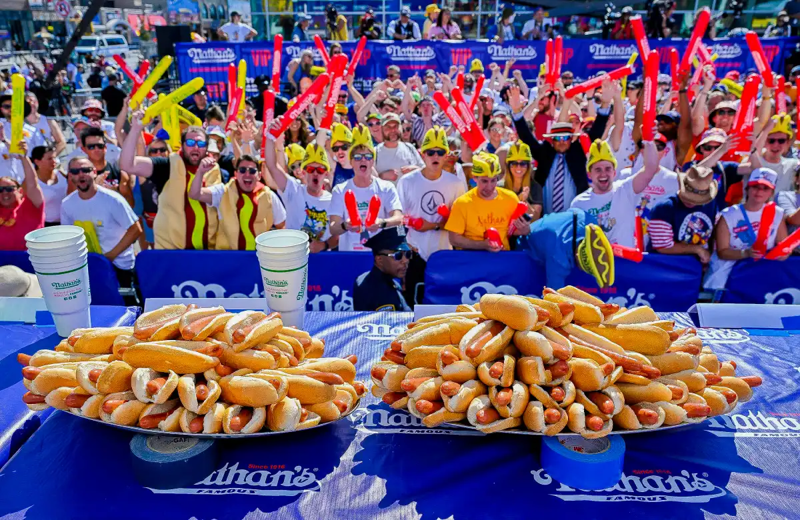

## Module

Please note that these materials have not yet completed the required pedagogical and industry peer-reviews to become a published module on the SCORE Network. However, instructors are still welcome to use these materials if they are so inclined.


{width=100% fig-align="center"}


## Introduction

The Nathan’s Famous Hot Dog Eating Contest has been held annually since 1972. Over time, changes in contest duration, training methods, and competitive intensity have shaped modern performance levels.

In this module, students explore contest data through a **closeread scrollytelling format** in Quarto. The goal is not only to analyze performance trends, but to understand how data visualization can be structured into a guided narrative.

Rather than simply producing graphs, students will learn how to structure visualizations into a guided analytical narrative.


## Background: Closeread

[**Closeread**](https://closeread.dev) is a Quarto extension that enables scrollytelling for HTML documents.

Scrollytelling is a style of web-based storytelling in which:

Text and graphics transition as the reader scrolls

Visual elements become “sticky” and remain fixed while the narrative changes

Attention is directed intentionally toward specific analytical moments

Closeread allows these techniques to be implemented directly within Quarto using structured sections and plot references.

## Closeread Structure

Closeread documents are built using three key components:

1. Sections

Sections define areas where scrollytelling behavior occurs

```{r}
'::::{.cr-section}
...
::::'
```

Everything inside a .cr-section behaves as part of the scroll-driven story.

2. Stickies (Plots or Elements to Highlight)

A sticky element is defined with a unique ID:

```{r}
#| warning: false
':::{#cr-plotname}
<plot code>
:::'
```

This element becomes pinned (or “sticky”) when triggered.

3. Referencing a Sticky

Inside the narrative text, reference the sticky using:

@cr-plotname

When that line scrolls into view, the corresponding sticky element becomes the focus.

::: {.callout-note collapse="true" title="Learning Objectives" appearance="minimal"}

By the end of this activity, you will be able to:

1. Create time series visualizations using ggplot
2. Explain why standardizing measurements (ex: hot dogs per minute) improves comparisons across time
3. Identify structural shifts in performance trends
4. Implement closeread syntax to build a scrollytelling data document in Quarto
5. Combine narrative reasoning with visual evidence

:::

::: {.callout-note collapse="true" title="Methods" appearance="minimal"}

Technology Requirements

- R
- RStudio
- Quarto with closeread extension installed

Statistical Concepts Used

- Time series plots
- Standardization (rates vs totals)
- Visual trend analysis
- Annotation of key observations

Technical Concepts Used

- tidyverse for data manipulation and plotting
- Closeread section and sticky syntax
- Narrative-triggered visualization

:::


## Data

This module uses a cleaned dataset of winners from the Nathan’s Famous Hot Dog Eating Contest from 1972 to 2025.

Download data: [hotdog_clean.csv]("hotdog_clean.csv")

<details>

<summary><b>Variable Descriptions</b></summary>

| Variable | Description                                               |
|----------|-----------------------------------------------------------|
| Year     | Year the competition took place                           |
| Sex      | Sex of the winner for the year the competition took place |
| Dogs     | Total hot dogs eaten                                      |
| Winner   | Name of the winner for their sex category                 |
| Time     | Time in minutes the competition elapsed                   |
| DPM      | Dogs eaten per minute                                     |

</details>


## Closeread essentials

Closeread adds one key idea to a normal Quarto document:

- A plot becomes a target when it has an ID like {#cr-plotname}

- Your narrative becomes a trigger when it references the target using @cr-plotname

- When the reader scrolls to that trigger, the plot becomes the focus

- You will see the same dataset multiple times. This is intentional, scrollytelling uses one anchor visualization and changes it slightly as the story advances.


## Exercises

Students will:

1. Construct a baseline plot of total hot dogs eaten over time.
2. Identify a structural shift in the early 2000s.
3. Standardize performance using hot dogs per minute.
4. Use closeread references to structure a scroll-based narrative.
5. Highlight Joey Chestnut’s winning years within the larger historical trend.

::: {.callout-note collapse="true" title="Summary" appearance="minimal"}

This module demonstrates how statistical reasoning and visual storytelling can be integrated into a cohesive scrollytelling experience. By combining careful metric selection with structured narrative flow, students learn not only how to analyze data, but how to communicate it effectively.

:::


```{r}
#| label: setup
#| include: false

library(tidyverse)
library(readr)

hotdog_clean <- read_csv("hotdog_clean.csv")

hotdog_men <- hotdog_clean |> filter(Sex == 1)
hotdog_women <- hotdog_clean |> filter(Sex == 0)

hotdog_men <- hotdog_men |> mutate(Hotdogs_per_minute = Dogs / Time)
hotdog_women <- hotdog_women |> mutate(Hotdogs_per_minute = Dogs / Time)

men_max_year <- hotdog_men |> slice_max(Hotdogs_per_minute, n = 1) |> pull(Year)
```

:::{#cr-intro}


:::

::::{.cr-section layout="sidebar-left"}

Step 1 — Establish an anchor plot @cr-anchor

Create one plot that the reader can return to throughout the story.
This “anchor plot” should be simple and readable. It does not need heavy styling.

Here, the anchor shows men’s winner performance over time, measured as hot dogs per minute. @cr-anchor

:::{#cr-anchor}

```{r}
#| label: anchor
#| echo: true
ggplot(hotdog_men, aes(x = Year, y = Hotdogs_per_minute)) +
  geom_point() +
  labs(title = "Men: Winners’ Eating Rates Over Time",
    x = "Year",
    y = "Hot Dogs per Minute") +
  theme_minimal()
```

:::

Locate years that look unusually high compared to nearby years.


Step 2 — Teach a storytelling transition: totals vs rates @cr-totals

Show how to justify a metric choice.
A common storytelling move is: start with the obvious metric (totals) and then explain why you switch to a fairer metric (rates).

This plot shows total hot dogs eaten by the men’s winner each year. @cr-totals

:::{#cr-totals}

```{r}
#| label: totals
#| echo: true
ggplot(hotdog_men, aes(x = Year, y = Dogs)) +
  geom_line() +
  geom_point() +
  labs(
    title = "Men: Total Hot Dogs Eaten by Year",
    x = "Year",
    y = "Total Hot Dogs (Winner)") +
  theme_minimal()
```

:::

This jump is worth investigating. Next, we check whether this is a real performance shift or a measurement issue

Step 3 — Add a distribution view (rates) @cr-hist

A histogram helps you define what “typical” looks like before you talk about extremes.

This histogram summarizes men’s winner pace across years. @cr-hist

:::{#cr-hist}

```{r}
#| label: hist
#| echo: true
ggplot(hotdog_men, aes(x = Hotdogs_per_minute)) +
  geom_histogram(bins = 12) +
  labs(
    title = "Men: Distribution of Winner Pace",
    x = "Hot Dogs per Minute",
    y = "Count of Years") +
  theme_minimal()
```

:::

Step 4 — Return to the anchor frame (rates over time) @cr-rate-time

Scrollytelling often reuses the same frame (Year vs performance) to keep readers oriented.

Here we go back to the time series, now using the fair metric (hot dogs per minute). @cr-rate-time

:::{#cr-rate-time}

```{r}
#| label: rate_time
#| echo: true
ggplot(hotdog_men, aes(x = Year, y = Hotdogs_per_minute)) +
  geom_line() +
  geom_point() +
  labs(
    title = "Men: Hot Dogs per Minute by Year",
    x = "Year",
    y = "Hot Dogs per Minute") +
  theme_minimal()
```

:::

Now answer the story question:
Is the jump still there when we standardize?
If yes, it supports the idea of a real performance-era shift.


Step 5 — Summarize the long-run direction (smooth) @cr-smooth

Smoothing helps you write a clean “big picture” sentence.

A smoother reduces year-to-year noise so your reader can see the overall direction. @cr-smooth

:::{#cr-smooth}

```{r}
#| label: smooth
#| echo: true
ggplot(hotdog_men, aes(x = Year, y = Hotdogs_per_minute)) +
  geom_point() +
  geom_smooth() +
  labs(
    title = "Men: Smoothed Trend in Winner Pace",
    x = "Year",
    y = "Hot Dogs per Minute") +
  theme_minimal()
```

:::

At this point, your narrative should do one thing:
Summarize the trend in one sentence.


Step 6 — Highlight Joey Chestnut’s winning years within the larger historical trend. @cr-joey

Keep the same plot frame, but highlight one “character moment.”

This is a common ending structure for data stories:
we move from “trend” -> “era.” @cr-joey

:::{#cr-joey}


```{r}
#| label: joey
#| echo: true
if ("Winner" %in% names(hotdog_men)) {

  joey_wins <- hotdog_men |> filter(Winner == "Joey Chestnut")

  ggplot(hotdog_men, aes(x = Year, y = Hotdogs_per_minute)) +
    geom_point(alpha = 0.6, color = "grey") +
    geom_point(data = joey_wins, size = 2, color = "black") +
    labs(
      title = "Joey Chestnut’s Winning Years Highlighted",
      x = "Year",
      y = "Hot Dogs per Minute"
    ) +
    theme_minimal()

} else {

  ggplot(hotdog_men, aes(x = Year, y = Hotdogs_per_minute)) +
    geom_point() +
    labs(
      title = "Joey highlight requires a Winner column",
      x = "Year",
      y = "Hot Dogs per Minute"
    ) +
    theme_minimal()

}

```
:::
:::

## Conclusion
Congratulations! You just finished your first data scrollytelling project!

Closeread has many different ways it can be used to show data. Hopefully this helped understand its overall introduction through a fun scrollytelling format.

## References

Bray, A., & Goldie, J. (2024). Closeread. https://closeread.dev

